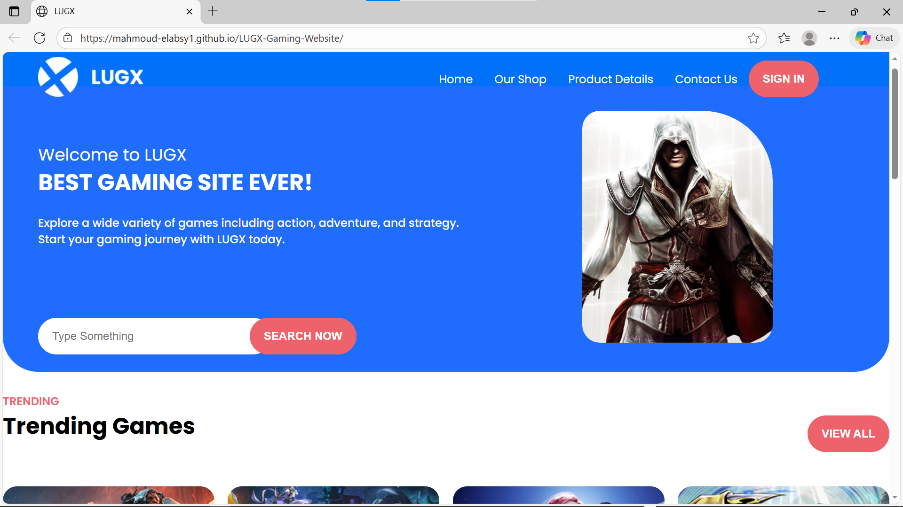

# 🎮 LUGX Gaming - Landing Page Implementation

A fully responsive gaming landing page built from scratch using **HTML5** and **CSS3**.
This project represents my first step towards becoming a **Backend Developer**, ensuring I have a solid understanding of the frontend structure before mastering server-side logic.

## Project Overview

- **Goal:** To practice semantic HTML and master CSS Layouts (Flexbox & Grid).
- **Responsive Design:** Optimized for different screen sizes.
- **Clean Code:** Structured and commented code for better maintainability.

## Tech Stack

- **HTML5** (Semantic Structure)
- **CSS3** (Custom Styling, Flexbox)
- **VS Code**

## Why this project?

As an aspiring **Node.js Backend Developer**, I believe that understanding how data is presented on the client side is crucial for designing efficient APIs. This project helped me bridge the gap between structure (HTML) and presentation (CSS).

## Live Demo

You can view the live project here: https://mahmoud-elabsy1.github.io/LUGX-Gaming-Website/

## Author

_Mahmoud Elabsy_  
Aspiring Backend Developer (Node.js)  
🚀 Always learning & improving
